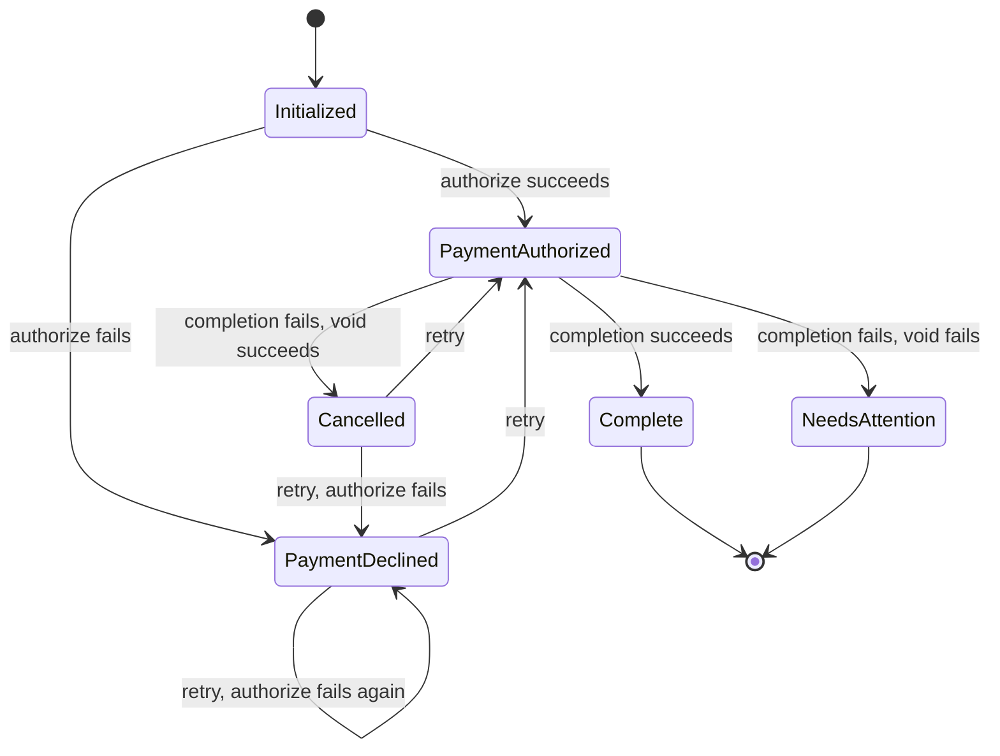

# Order State Machine

A TypeScript/Express service modeling an order state machine with stage-dependent failure recovery.

---

## How to Run

```bash
npm install
npm test       # run all tests
npm run dev    # development server on :3000
```

The service uses SQLite with an in-memory database, so state does not persist across restarts. No external dependencies are required.

A browser-based test UI is available at `http://localhost:3000` when the dev server is running.

---

## What I Built

A REST API that enforces a sequential checkout flow — initialization, payment authorization, and completion — where each failure mode triggers a different recovery path:

- **Payment declined** → reject the order. No cleanup needed.
- **Completion fails after payment authorized** → void the payment, mark as `Cancelled`.
- **Completion fails and void also fails** → mark as `NeedsAttention` for manual resolution. Alert fires.

### State Machine

| Status | Description |
|---|---|
| `Initialized` | Order created, awaiting checkout |
| `PaymentAuthorized` | Payment authorized; completion in progress |
| `PaymentDeclined` | Authorization failed |
| `Cancelled` | Completion failed; payment voided |
| `NeedsAttention` | Completion failed and void also failed |
| `Complete` | Order successfully fulfilled |



Valid transitions are declared in a single `VALID_TRANSITIONS` table in `OrderStatus.ts`. `Order.tryCheckout()` consults the table rather than implementing ad-hoc guards — the state machine is auditable at a glance and new states are cheap to add.

`PaymentDeclined` and `Cancelled` are retryable. `NeedsAttention` and `Complete` are terminal.

`PaymentAuthorized` is a transitional status logged for diagnostic value. Without it, a resolving agent would have to query the payment provider directly to determine whether a charge is outstanding. It is not a stable resting state: the order moves through it immediately to `Complete`, `Cancelled`, or `NeedsAttention` within the same request. On retry, a fresh authorization is always issued — resuming a stale one risks acting on a charge that has already expired or been reversed.

### Checkout Logic

```
tryCheckout(payment, paymentId) → OrderStatus

if !canTransition(currentStatus, PaymentAuthorized):
  throw InvalidTransitionError

try:
  payment.authorize()
  LogStatus(PaymentAuthorized)
  tryComplete()

catch PaymentDeclined:
  LogStatus(PaymentDeclined)
  return PaymentDeclined

catch CompletionFailed:
  try:
    payment.void()
    LogStatus(Cancelled)
    return Cancelled
  catch:
    LogStatus(NeedsAttention)
    return NeedsAttention

LogStatus(Complete)
return Complete
```

### Models

#### `Order`
- `clientId: string`
- `ticketIds: string[]`

Key methods: `initialize()`, `tryCheckout(payment, paymentId)`, `getStatus()`, `getStatusHistory()`

#### `PaymentMethod`
A stub interface with two methods: `authorize()` and `void()`. Either can be configured to throw to simulate failure scenarios.

### API

| Endpoint | Description |
|---|---|
| `POST /orders` | Initialize an order. Body: `{ clientId, ticketIds }` |
| `POST /orders/:orderId/checkout` | Advance through payment + completion. Body: `{ paymentId }` |
| `GET /orders/:orderId/status` | Get current status and full status history |

`POST /checkout` on a `Complete` order returns `409 Conflict`. Tickets are non-fungible — once transferred, re-checkout on the same order would risk double-transfer to the same or a different buyer.

`POST /checkout` on a `NeedsAttention` order also returns `409`. Manual resolution is required before the order can proceed.

### Data Storage

Status transitions are stored in a dedicated append-only `order_status_history` table rather than a single `status` column on the orders row. This design has compounding benefits beyond what a flat field provides:

- **Concurrency control.** In a multi-instance deployment, the latest row in `order_status_history` is the authoritative current state. Reads against an index on `(order_id, id DESC)` are fast enough to serve as a real-time gate before each checkout attempt. Combined with a DB-level lock (e.g. `SELECT ... FOR UPDATE` on the order row, or a `checkout_locks` table), this provides a reliable serialization point — a second concurrent checkout reads the committed status before it can write, so it either blocks or fails fast rather than racing silently.

- **Troubleshooting `NeedsAttention` orders.** When an order reaches `NeedsAttention`, the full history shows exactly which statuses preceded it and when, giving a resolving agent a self-contained audit trail without querying external systems. The proposed `message` field (see What I'd Do Differently) would further capture the error type and payment provider response at each step.

- **Systemic health monitoring.** Aggregating across the table surfaces patterns that single-order views miss: a spike in `PaymentDeclined` may indicate a payment provider degradation; a spike in `NeedsAttention` points to a completion service outage; an elevated `Cancelled` rate suggests the void path is working but completion is unreliable. These signals are available for free once the data is in a queryable table.

### Test Coverage

| Scenario | Final Status | Alert? |
|---|---|---|
| Happy path | `Complete` | No |
| Invalid request body | unchanged (400) | No |
| Order not found | unchanged (404) | No |
| Order in terminal state | unchanged (409) | No |
| Payment authorization fails | `PaymentDeclined` | No |
| Completion fails, void succeeds | `Cancelled` | No |
| Completion fails, void also fails | `NeedsAttention` | **Yes** |

---


## Tradeoffs

**SQLite over plain in-memory structures.** Even though the database is in-memory (`:memory:`), using SQLite gives the status history a real relational model with timestamps, ordered rows, and indexed lookups. The schema makes the audit trail queryable and the storage layer easy to swap for a persistent DB later.

**Serialized payment + completion processing.** Payment authorization and order completion run sequentially in a single request. This preserves transaction integrity at the cost of some latency, which is the right tradeoff: a checkout where a charge and a ticket transfer are partially applied is a harder problem than a slightly slower checkout.

**`PaymentAuthorized` as a transitional status.** Logging `PaymentAuthorized` immediately before attempting completion means the status history alone is sufficient to determine whether a charge is outstanding on a failed order. The alternative — inferring authorization from the presence of a `paymentId` — requires cross-referencing the payment provider.

**Explicit `VALID_TRANSITIONS` table.** Declaring valid transitions as a data structure has real advantages: the entire state machine is visible in one place, every `logStatus` call is uniformly gated by `assertTransition` so invalid transitions fail loudly, and adding a new state requires only a new table entry rather than changes scattered across business logic. The table can also be unit-tested in isolation, independent of the checkout flow.

The tradeoff is expressiveness. A data-driven table can only represent "from → to" edges — it has no way to encode the *conditions* under which a transition is valid. Guard clauses like "can only transition to `FraudReview` if the order value exceeds a threshold" or "void is only allowed if authorization happened within 24 hours" must live in the calling code, outside the table. This means the table is not a complete specification of the state machine; it's a partial one, and the rest is implicit in the surrounding logic.

The alternative — encoding transitions implicitly in code, using TypeScript discriminated unions and exhaustive `switch` statements — can surface invalid transitions at compile time rather than runtime, and keeps each transition co-located with the conditions that trigger it. The cost is readability and maintainability: the full set of valid transitions is no longer visible in one place, and adding a new state requires auditing every `switch` block that might need to handle it. For a machine this size, either approach works; the table wins on clarity. At significantly higher complexity, a dedicated state machine library such as XState handles both.

**Scope exclusions:**
- **Inventory management** is out of scope. The service assumes tickets are available; seat reservation and locking against concurrent buyers are not modeled.
- **`tryComplete()` is a stub.** Ticket transfer mechanics (downstream API calls, retries, idempotency keys) are outside scope.
- **`NeedsAttention` resolution is detected but not routed.** The mechanism for assigning cases to a support queue is not built out.
- **Distributed write race conditions are out of scope.** Concurrent checkout attempts on the same order are not guarded against. This would be addressed with a DB-level pessimistic lock: an atomic `INSERT ... SELECT` into a `checkout_locks` table, claimed at checkout entry and released in a `finally` block. A TTL column plus a background reaper (or a DB-native advisory lock) would handle abandoned locks in production.
- **Simulation infrastructure is mixed into production stubs.** `PaymentMethod` and `Order.tryComplete()` call `throwIfSimulated()` directly, which means error injection logic lives inside the production code path. The tests don't use this — they use Jest spies. The simulation system exists solely to power the browser-based demo UI. In a real service this would be extracted: either a separate injectable test double, or a middleware-level flag that never touches the core model code.

---

## What I'd Do Differently

**`NeedsAttention` routing.** The right approach depends on who resolves it. For human agents, a `GET /orders?status=NeedsAttention` endpoint feeds a support queue polled by a recurring job. For automated agents, a pub-sub model pushes directly onto an event queue. The current implementation fires an in-process alert — the hook is there, but the destination isn't.

**Status transition messages.** Each `order_status_history` row could carry an optional `message` field — the payment provider's decline code on `PaymentDeclined`, the error type on `NeedsAttention`, a correlation ID on `Cancelled`. This makes the history self-contained for diagnostics and support triage without requiring a separate log query.

**Rate limiting.** Without it, rapid duplicate checkout attempts on the same order can race. Needed for both data integrity and abuse protection.

**Additional intermediate states.** The `VALID_TRANSITIONS` table was designed to accommodate these without changes to business logic — a new state requires only a new entry in the table:
- `FraudReview` — flagged by a risk model; blocks checkout pending manual or automated clearance.
- `RateLimited` — too many attempts in a short window; blocks until cooldown expires.
- `InventoryHold` — tickets reserved but not yet confirmed available; checkout paused until the hold resolves or times out.
- `AwaitingExternalConfirmation` — payment authorized but completion is waiting on an async callback (e.g. a 3DS challenge or a slow downstream ACK).
- `OrderExpired` — initialized but not checked out within an allowed window; terminal state that prevents fulfillment of stale orders.
- `PromotionExpired` — promotional price applied at initialization is no longer valid at checkout; blocks completion and prompts re-pricing before retry.
