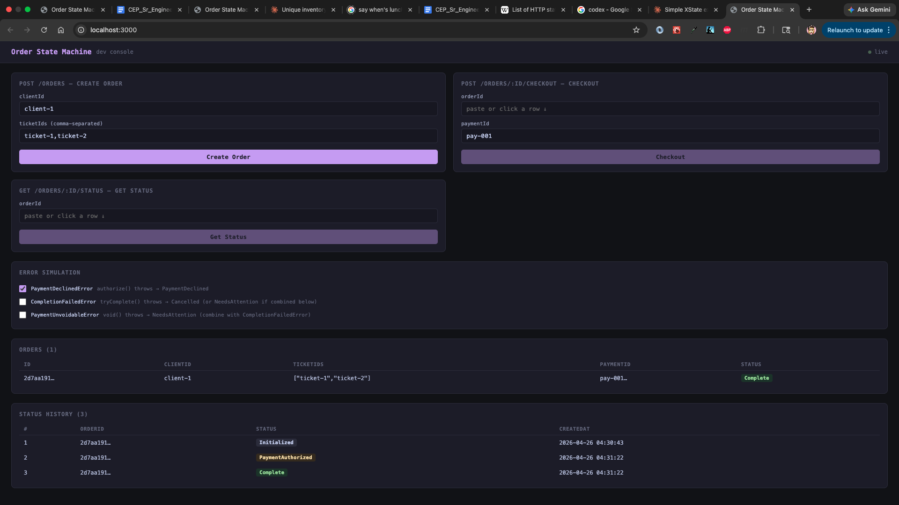
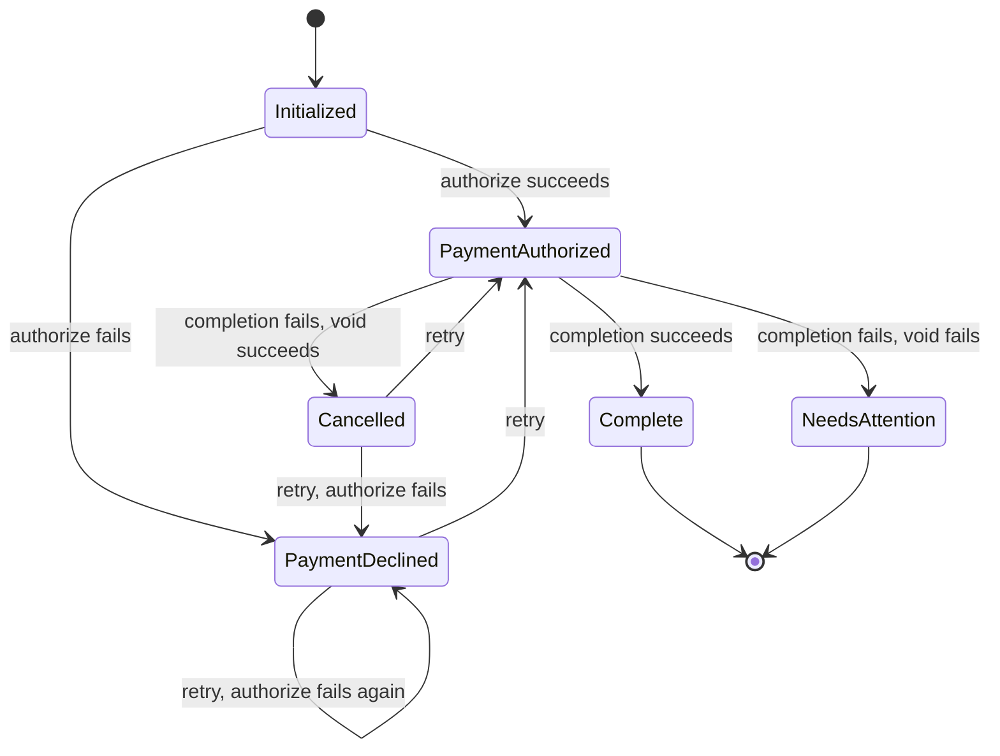

# Order State Machine

A TypeScript/Express service modeling an order state machine with stage-dependent failure recovery and historical status logging.

---

## How to Run

```bash
npm install
npm test       # run all tests
npm run dev    # development server on :3000
```

The service uses SQLite with an in-memory database, so state does not persist across restarts. No external dependencies are required.

### Dev Console

A browser-based dev console is available at `http://localhost:3000` when the dev server is running.



The console exposes the full API as interactive forms and provides a live view of the database state:

- **Create Order** — submits `POST /orders` and populates the order table below
- **Checkout** — submits `POST /orders/:id/checkout`; the orderId field auto-fills when you click a row in the orders table
- **Get Status** — submits `GET /orders/:id/status`
- **Error Simulation** — toggles [`throwIfSimulated()`](src/simulation.ts#L17) for each error class, allowing any failure path to be triggered without modifying code: `PaymentDeclinedError` alone produces `PaymentDeclined`; `CompletionFailedError` alone produces `Cancelled`; both together produce `NeedsAttention`
- **Orders table** — live view of all orders in the in-memory DB, with current status
- **Status History table** — append-only log of every status transition, with timestamps

---

## What I Built

A REST API that enforces a sequential checkout flow — initialization, payment authorization, and completion — where each failure mode triggers a different recovery path:

- **Payment declined** → reject the order. No cleanup needed.
- **Completion fails after payment authorized** → void the payment, mark as `Cancelled`.
- **Completion fails and void also fails** → mark as `NeedsAttention` for manual resolution. Alert fires.

### State Machine

| Status | Description |
|---|---|
| `Initialized` | Order created, awaiting checkout |
| `PaymentAuthorized` | Payment authorized; completion in progress |
| `PaymentDeclined` | Authorization failed |
| `Cancelled` | Completion failed; payment voided |
| `NeedsAttention` | Completion failed and void also failed |
| `Complete` | Order successfully fulfilled |



Valid transitions are declared in a single [`VALID_TRANSITIONS`](src/models/OrderStatus.ts#L33) table in [`OrderStatus.ts`](src/models/OrderStatus.ts). [`Order.tryCheckout()`](src/models/Order.ts#L73) consults the table rather than implementing ad-hoc guards — the state machine is auditable at a glance and new states are cheap to add.

`PaymentDeclined` and `Cancelled` are retryable. `NeedsAttention` and `Complete` are terminal; i.e. the user cannot attempt a subsequent checkout on the order (until the issue is resolved).

`PaymentAuthorized` is a transitional status, not a stable resting state: the order moves through it immediately to `Complete`, `Cancelled`, or `NeedsAttention` within the same request. On retry, a fresh authorization is always issued — resuming a stale one risks acting on a charge that has already expired or been reversed.

### Checkout Logic

```
tryCheckout(payment, paymentId) → OrderStatus

assertCheckoutAllowed(currentStatus)  // early exit -- checkout not attempted

try:
  payment.authorize()
  assertTransition(currentStatus, PaymentAuthorized)
  LogStatus(PaymentAuthorized)
  currentStatus ← PaymentAuthorized
  tryComplete()

catch PaymentDeclined:
  assertTransition(currentStatus, PaymentDeclined)
  LogStatus(PaymentDeclined)
  return PaymentDeclined

catch CompletionFailed:
  try:
    payment.void()
    assertTransition(currentStatus, Cancelled)  // currentStatus = PaymentAuthorized
    LogStatus(Cancelled)
    return Cancelled
  catch:
    assertTransition(currentStatus, NeedsAttention)  // currentStatus = PaymentAuthorized
    LogStatus(NeedsAttention)
    return NeedsAttention

assertTransition(currentStatus, Complete)  // currentStatus = PaymentAuthorized
LogStatus(Complete)
return Complete
```

The full implementation is in [`Order.tryCheckout()`](src/models/Order.ts#L73). `tryCheckout` acts as an orchestrator for the checkout flow — `Order` is the aggregate root, so placing the coordination logic on the model keeps the call site natural (`order.tryCheckout(payment, paymentId)`) and the tests clean. At production scale a separate `CheckoutService` would be advantageous for decoupling data modeling and orchestration concerns.

### Models

#### [`Order`](src/models/Order.ts#L17)
- `clientId: string`
- `ticketIds: string[]`

Key methods: [`initialize()`](src/models/Order.ts#L38), [`tryCheckout(payment, paymentId)`](src/models/Order.ts#L73), [`getStatus()`](src/models/Order.ts#L43), [`getStatusHistory()`](src/models/Order.ts#L53)

#### [`PaymentMethod`](src/models/PaymentMethod.ts#L6)
A stub interface with two methods: [`authorize()`](src/models/PaymentMethod.ts#L14) and [`void()`](src/models/PaymentMethod.ts#L19). Either can be configured to throw to simulate failure scenarios.

### Data Storage

Two tables: [`orders`](src/database.ts#L10) holds the order record (`id`, `client_id`, `ticket_ids`, `payment_id`), and [`order_status_history`](src/database.ts#L17) holds the state log (`order_id`, `status`, `created_at`). The tables are related by `order_id` — every status row is a child of an order row.

The `orders` table carries no `status` column. Current status is derived from `order_status_history` by selecting the most recent row for a given `order_id`. This means `orders` is purely structural — it records what the order is (which client, which tickets, which payment), while `order_status_history` records what happened to it. Neither table encodes the other's concern.

### API

| Endpoint | Description |
|---|---|
| [`POST /orders`](src/routes/orders.ts#L21) | Initialize an order. Body: `{ clientId, ticketIds }` |
| [`POST /orders/:orderId/checkout`](src/routes/orders.ts#L35) | Advance through payment + completion. Body: `{ paymentId }` |
| [`GET /orders/:orderId/status`](src/routes/orders.ts#L72) | Get current status and full status history |

`POST /checkout` on a `Complete` order returns `409 Conflict`. Tickets are non-fungible — once transferred, so an order cannot be completed twice.

`POST /checkout` on a `NeedsAttention` order also returns `409`. Manual resolution is required before the order can proceed.

### Test Coverage

64 tests across two files.

[`tests/order.test.ts`](tests/order.test.ts) — unit tests against the `Order` model directly:
- [`getStatus()`](tests/order.test.ts#L29) — verifies initial status before checkout
- [`tryCheckout()` — method call behavior](tests/order.test.ts#L35) — verifies which collaborators (`authorize`, `tryComplete`, `void`) are called or skipped under each failure path
- [`tryCheckout()` — outcome scenarios](tests/order.test.ts#L95) — the four required cases: happy path, payment decline, completion fail + void success, completion fail + void fail
- [`statusHistory`](tests/order.test.ts#L131) — verifies full status sequences for each path, timestamp presence, and chronological ordering

[`tests/api.test.ts`](tests/api.test.ts) — integration tests against the HTTP API:
- [`POST /orders`](tests/api.test.ts#L20) — valid creation and input validation (missing fields, wrong types)
- [`POST /orders/:orderId/checkout`](tests/api.test.ts#L58) — all checkout outcomes, retry eligibility by status, invalid/missing paymentId, unknown order
- [`GET /orders/:orderId/status`](tests/api.test.ts#L302) — status and history responses for each outcome path, timestamp ordering, unknown order

---

## Assumptions

#### Fulfillment is hand-waved

[`tryComplete()`](src/models/Order.ts#L63) is a stub — it represents transferring tickets to the buyer but does nothing. A robust system would require a dedicated fulfillment model and service handling inventory reservation, seat locking, and downstream confirmation. That service would still be orchestrated by `tryCheckout` as another participant in the checkout flow, keeping the coordination logic in one place.

#### `NeedsAttention` resolution is out of scope

When an order reaches `NeedsAttention`, [`fireAlert()`](src/alerts.ts#L1) is called immediately. The stub logs to `console.warn`; in production it would enqueue to a support ticket system. Resolution itself is not implemented — the right approach depends on who resolves the order: for human agents, a `GET /orders?status=NeedsAttention` endpoint could feed a support queue polled by a recurring job — polling latency is negligible if resolution happens on human timescales. For automated agents, a pub-sub model could push directly into an event queue for immediate assignment.

---

## Tradeoffs

#### Explicit [`VALID_TRANSITIONS`](src/models/OrderStatus.ts#L33) table

The table keeps the full state machine auditable in one place, uniformly gates every transition through [`assertTransition`](src/models/OrderStatus.ts#L46), and makes new states cheap to add — a new entry in the table is all that's required, with no changes to business logic. The tradeoff is expressiveness: it can only encode "from → to" edges, not the conditions under which a transition is valid. Guards and side effects end up scattered across calling code rather than co-located with the transitions they govern. The alternative — inline transitions — keeps each transition co-located with its conditions but loses the at-a-glance auditability. At production scale, a dedicated state machine library like XState is the better choice: it models guards, entry/exit actions, and async flows as first-class concepts while keeping the machine visualizable and auditable.

#### Orchestration over choreography

[`Order.tryCheckout()`](src/models/Order.ts#L73) acts as an orchestrator: it owns the full checkout sequence, calls each participant ([`PaymentMethod`](src/models/PaymentMethod.ts#L6), [`tryComplete`](src/models/Order.ts#L63)) directly, and decides what to do based on the result. The participants are stateless and unaware of each other or the broader workflow.

The alternative is choreography, where each participant reacts to events independently — a completion service listens for `PaymentAuthorized`, a void service listens for `CompletionFailed`, a status service listens to everything. There's no central coordinator; the flow is implicit in the event topology. Choreography scales better and decouples services, but reconstructing why an order reached `NeedsAttention` means tracing events across multiple consumers. Orchestration keeps the failure recovery logic explicit and in one place, which makes it straightforward to read, test, and reason about.

A conventional alternative to placing the orchestrator on the model is a dedicated service layer — a `CheckoutService` that coordinates `Order` and `PaymentMethod` while keeping the model focused on state. That separation becomes worthwhile as the flow grows and `tryCheckout` accumulates more dependencies and branching. At this scale it would add abstraction without pulling its weight.

#### Append-only [`order_status_history`](src/database.ts#L17) table over a single status field

Storing each transition as a new row rather than overwriting a `status` column on the order means the full sequence of states is always available, not just the current one. The cost is a slightly more complex query for current status (`ORDER BY id DESC LIMIT 1` vs. a direct column read) and more storage. Pros and cons:

- **Troubleshooting `NeedsAttention` orders.** The full history shows exactly which statuses preceded it and when, giving a resolving agent a self-contained audit trail without querying external systems.
- **Service health monitoring.** Aggregating across the table surfaces patterns that single-order views miss: a spike in `PaymentDeclined` may indicate a payment provider degradation; a spike in `NeedsAttention` points to a completion service outage; an elevated `Cancelled` rate suggests the void path is working but completion is unreliable.

#### Serialized payment + completion processing

Payment authorization and order completion run sequentially in a single request. This preserves transaction integrity at the cost of some latency, which is the right tradeoff: a checkout where a charge and a ticket transfer are partially applied is a harder problem to resolve than a slightly slower checkout; if concurrency is required, more fine-grained intermediates states can be created to improve state machine accuracy.

---

## What I'd Do Differently

#### Richer transition definitions

At production scale, the [`VALID_TRANSITIONS`](src/models/OrderStatus.ts#L33) table would need to express more than "from → to" edges. Guards (blocking a transition unless a runtime condition is met — e.g. order value below a fraud threshold, cooldown window elapsed) and side effects (actions that fire on entering a state — e.g. triggering an alert on `NeedsAttention`, releasing an inventory hold on `Cancelled`) would need to be co-located with the transitions they govern rather than scattered across calling code. At that point, a dedicated state machine library like XState is worth considering — it handles guards, entry/exit actions, async flows, and nested states as first-class concepts, and ships a visualizer that keeps the machine diagram in sync with the implementation.

#### Locking table to prevent concurrent checkouts

Two simultaneous checkout requests on the same order will both pass `assertCheckoutAllowed`, both call `payment.authorize()`, and both write to `order_status_history` — resulting in a double charge. Optimistic locking on a status column would catch the conflict at the DB write, but only after both requests have already hit the payment provider. That's too late.

A dedicated `order_locks` table (`order_id TEXT PRIMARY KEY`) solves this at the right layer: at the start of checkout, `INSERT INTO order_locks (order_id) VALUES (?)`. SQLite's unique constraint makes this atomic — only one request succeeds; the other fails immediately, before `payment.authorize()` is ever called. The lock is released with `DELETE FROM order_locks WHERE order_id = ?` once checkout completes, whether it succeeded or failed. This is pessimistic locking, which is the correct choice here: the cost of a spurious payment authorization far exceeds the cost of occasionally serializing two legitimate retries.

#### Richer [`order_status_history`](src/database.ts#L17) rows

Each row currently records only `order_id`, `status`, and `created_at`. Several additional columns would make the history self-sufficient for diagnostics without cross-referencing other tables or external systems:

- **`previous_status`** — makes each row a complete record of the transition rather than just a point-in-time snapshot. Without it, a concurrent write anomaly is invisible: two requests can both read the same current status, both pass [`assertTransition`](src/models/OrderStatus.ts#L46), and both write successfully — the sequence looks valid row by row but the same "from" state appears twice. With `previous_status`, a query for rows where `previous_status != lag(status)` surfaces the inconsistency immediately, and an insert trigger could reject a row whose `previous_status` doesn't match the most recent status, turning silent corruption into a loud failure.

- **`payment_id`** — the [`orders`](src/database.ts#L10) table holds only the most recent `payment_id`, overwritten on each retry. Recording `payment_id` on each history row instead preserves the full sequence of which payment method was in play at each transition. This is useful for fraud detection (repeated attempts across payment IDs), support triage (correlating a provider-side charge with the order that produced it), and auditing retried orders where the customer switched payment methods between attempts.

- **`completion_result` on `orders`** — [`tryComplete()`](src/models/Order.ts#L63) currently returns `void`. In production it would return something concrete — a ticket transfer confirmation ID, a fulfillment reference — and that result is currently not persisted anywhere. Storing it on `orders` means a support agent can look up the fulfillment reference directly from the order record rather than querying an external system.

#### Extract simulation infrastructure from production code

[`PaymentMethod`](src/models/PaymentMethod.ts#L6) and [`Order.tryComplete()`](src/models/Order.ts#L63) call [`throwIfSimulated()`](src/simulation.ts#L17) directly, which means error injection logic lives inside the production code path. The tests don't use this — they use Jest spies. The simulation system exists solely to power the browser-based demo UI. In a real service this would be extracted: either a separate injectable test double, or a middleware-level flag that never touches the core model code.

#### Status transition messages

Each `order_status_history` row could carry an optional `message` field — the payment provider's decline code on `PaymentDeclined`, the error type on `NeedsAttention`, a correlation ID on `Cancelled`. This makes the history self-contained for diagnostics and support triage without requiring a separate log query.

